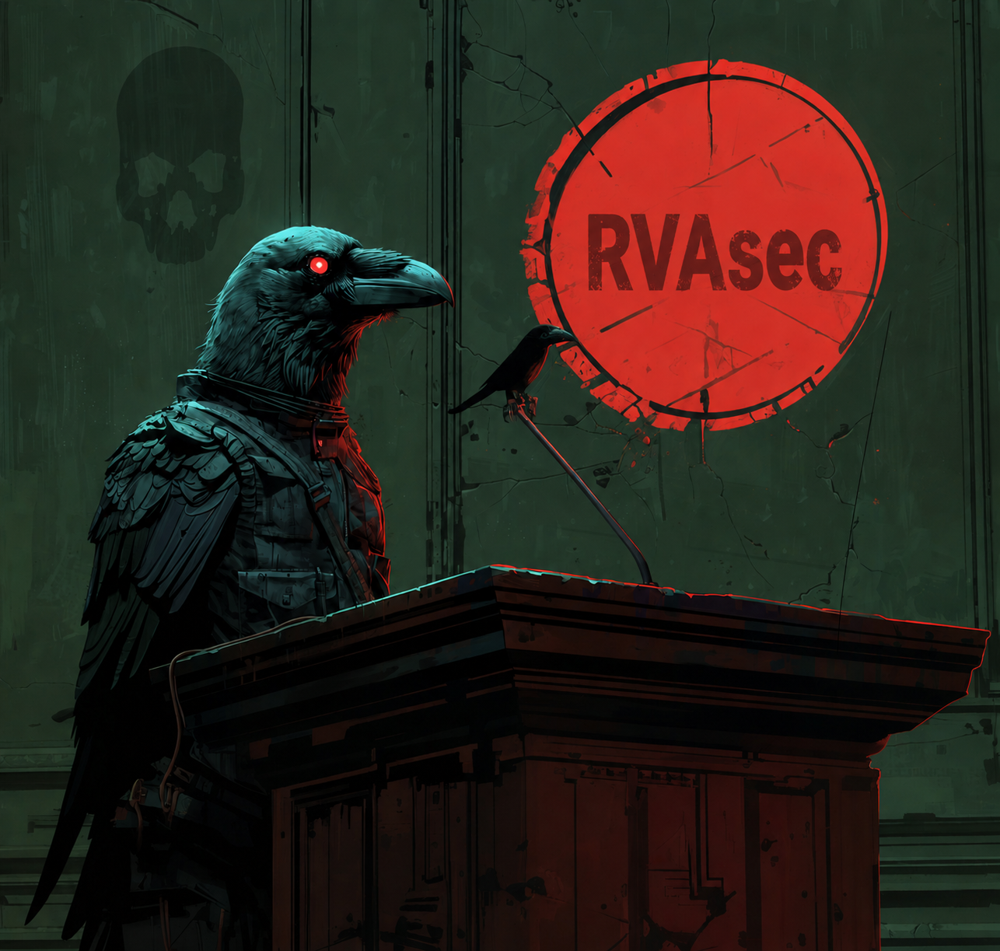

# RVAsec Presentations

Archive of speaker slides from [RVAsec](https://rvasec.com), the annual Richmond, Virginia information security conference.

## Conferences

| Year | Event                                          | Videos                                                                                | Slides              |
|------|------------------------------------------------|---------------------------------------------------------------------------------------|---------------------|
| 2012 | [RVAsec 1](https://2012.rvasec.com/)           | [YouTube](https://www.youtube.com/playlist?list=PLyK0rk0vIZ0e2291kAK8mjb5WPlrl9QGz)   | [Slides](./2012/)   |
| 2013 | [RVAsec 2](https://2013.rvasec.com/)           | [YouTube](https://www.youtube.com/playlist?list=PLyK0rk0vIZ0c6pNZDERj2_M4Nkz_FPzTK)   | [Slides](./2013/)   |
| 2014 | [RVAsec 3](https://2014.rvasec.com/)           | [YouTube](https://www.youtube.com/playlist?list=PLyK0rk0vIZ0eYE1j3pcfyPTE-pVBfRs7h)   | [Slides](./2014/)   |
| 2015 | [RVAsec 4](https://2015.rvasec.com/)           | [YouTube](https://www.youtube.com/playlist?list=PLyK0rk0vIZ0dYBZzNE8JK4aoRWdVSASLE)   | [Slides](./2015/)   |
| 2016 | [RVAsec 5](https://2016.rvasec.com/)           | [YouTube](https://www.youtube.com/playlist?list=PLyK0rk0vIZ0cbB7adUp7KNZC4MNwXBCim)   | [Slides](./2016/)   |
| 2017 | [RVAsec 6](https://2017.rvasec.com/)           | [YouTube](https://www.youtube.com/playlist?list=PLyK0rk0vIZ0e-_DrrPWGEDfYzWhtPjDAQ)   | [Slides](./2017/)   |
| 2018 | [RVAsec 7](https://2018.rvasec.com/)           | [YouTube](https://www.youtube.com/playlist?list=PLyK0rk0vIZ0edWaSGpYCr6J5Tx0noKdQi)   | [Slides](./2018/)   |
| 2019 | [RVAsec 8](https://2019.rvasec.com/)           | [YouTube](https://www.youtube.com/playlist?list=PLyK0rk0vIZ0fmC-OZK0MWjZwe5MB9J1ay)   | [Slides](./2019/)   |
| 2021 | [RVAsec 10](https://2021.rvasec.com/)          | [YouTube](https://www.youtube.com/playlist?list=PLyK0rk0vIZ0evFdaF94b9uGdgvEkrz_gC)   | [Slides](./2021/)   |
| 2023 | [RVAsec 12](https://2023.rvasec.com/)          | [YouTube](https://www.youtube.com/playlist?list=PLyK0rk0vIZ0ey3KLTKcZh3SZF61otS3Vu)   | [Slides](./2023/)   |
| 2024 | [RVAsec 13](https://2024.rvasec.com/)          | [YouTube](https://www.youtube.com/playlist?list=PLyK0rk0vIZ0fNDzboOeIpXEbMHPPpEFHh)   | [Slides](./2024/)   |
| 2025 | [RVAsec 14](https://2025.rvasec.com/)          | [YouTube](https://www.youtube.com/playlist?list=PLyK0rk0vIZ0dRpFVCSqj-u5vwLfJeOCUN)   | [Slides](./2025/)   |

## Copyright

**Copyright in each presentation belongs to the original speaker / author, not RVAsec LLC.** RVAsec LLC hosts these materials with the speakers' permission as a public archive of conference content. All rights are reserved by the respective creators unless a speaker has explicitly applied an open license to their own file.

If you wish to reuse, redistribute, or excerpt any slide deck beyond fair use, contact the speaker directly.

## Copyright Infringement / Takedown

Speakers are solely responsible for ensuring they have the right to use any third-party content (images, quoted text, logos, trademarks, code, etc.) included in their presentations. RVAsec LLC does not vet presentations for licensing compliance.

If you believe material in this repository infringes your copyright or other intellectual-property rights:

1. Email [RVAsec LLC](https://rvasec.com/) with:
   - The specific file path in this repository,
   - Identification of the work you believe is infringed,
   - Your contact information,
   - A statement that you have a good-faith belief the use is not authorized.
2. RVAsec LLC will remove the file from this repository upon receipt of a good-faith request.

Removal is a courtesy and does not constitute an admission of infringement. Disputes between the rights holder and the speaker are between those parties; RVAsec LLC is not a party to them.

## Contributing

Speakers wishing to add, update, or withdraw their own slides: open an issue or pull request, or contact RVAsec directly.